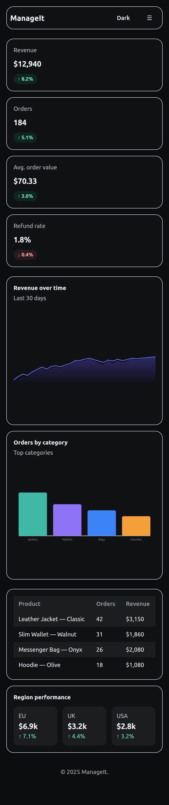
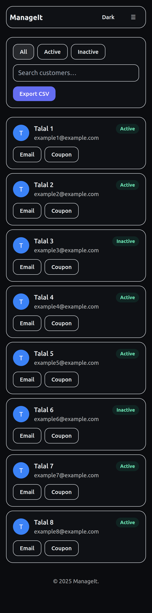
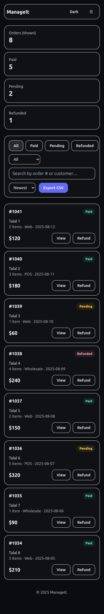

ManageIt — Admin Dashboard

A colorful, accessible, mobile-first admin dashboard showcasing best practices for responsive UI, accessibility, and clean React/Next.js architecture.

Live Demo

Vercel: add your link here

Preview

Overview

ManageIt is a demo admin UI built for your portfolio. It focuses on:

*Clean, minimal, multi-page layout: Overview, Orders, Customers, Reports, Settings.
*Accessible patterns (skip links, aria-labels, keyboard-friendly controls)
*Responsive design (desktop grid/table → mobile cards)
*Dark-mode by default with a user toggle.

Features

*Header & Nav: brand left, centered menu on desktop, theme toggle + avatar right; working mobile menu (hamburger).
*Overview: KPI cards, charts (placeholders/components), tidy layout.
*Orders (New layout): filter pills, channel select, search + sort, card-based list (no clipped columns on mobile).
*Customers (New layout): filter pills + search, responsive grid cards with quick actions (Email, Coupon).
*Reports: spacing-tuned filters, clean visual sections.
*Settings (Unique): compact accordion sections, simple Invoices list.
*OG image: public/og.png for social preview cards.

Tech Stack

*Next.js (App Router), React, TypeScript.
*Tailwind CSS (utility classes + small custom styles in app/globals.css)
*Lightweight components (no heavy UI lib), accessible HTML semantics.

Getting Started

# 1) Clone
git clone https://github.com/<YOUR_GITHUB_USERNAME>/manageit-dashboard.git
cd manageit-dashboard

# 2) Install
npm install

# 3) Run dev server
npm run dev
# open http://localhost:3000

